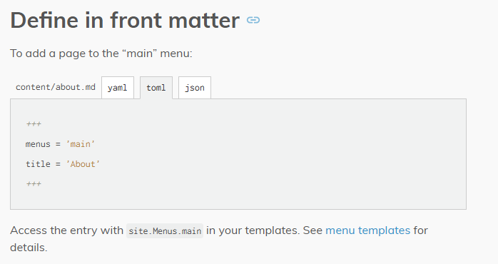

+++
date = '2024-12-09T10:17:05Z'
draft = true
title = 'A selection of Menus'
+++
Why are there 5 hundred ways to build a menu!?

- [Hugo Menu Docs](https://gohugo.io/content-management/menus/)
- [How to create multilevel dropdown menu in hugo?](https://discourse.gohugo.io/t/how-to-create-multilevel-dropdown-menu-in-hugo/18373/8)

I've stuck to the "front matter" method for now as that seems to bethe easies but I don't really get a nexted menu this way (2+ levels) if I wanted to list a number of pages below categories.

Oh well...